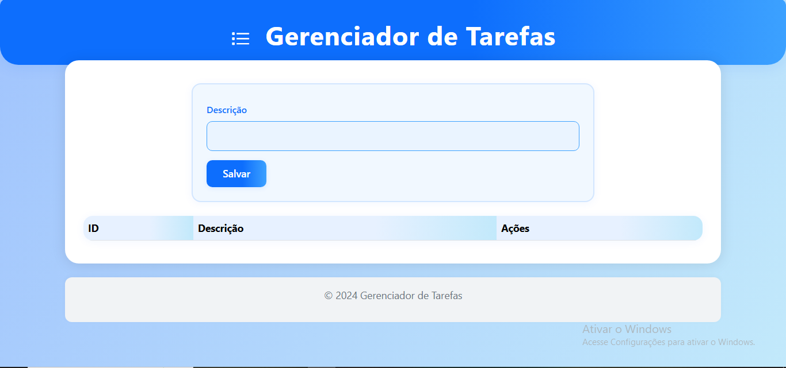

# Projeto ASP.NET

# Gerenciador de Tarefas ASP.NET 8.0

## Descrição

Este projeto é uma aplicação web simples para **gerenciamento de tarefas**, desenvolvida em **ASP.NET 8.0** com Entity Framework Core e MySQL.  
Permite **cadastrar, listar, editar, concluir e excluir tarefas** em uma única tabela no banco de dados.

---

## Funcionalidades

- **Adicionar tarefa:** Informe a descrição e salve.
- **Listar tarefas:** Visualize todas as tarefas cadastradas.
- **Concluir tarefa:** Marque uma tarefa como concluída.
- **Excluir tarefa:** Remova uma tarefa após confirmação.
- **Interface moderna:** Utiliza Bootstrap 5 e Bootstrap Icons.

---


## Estrutura do Projeto

O projeto está organizado em pastas e arquivos conforme boas práticas do ASP.NET Core MVC:

```
Gerenciador_De_Tarefas/
  appsettings.json
  appsettings.Development.json
  Program.cs
  Data/
    TarefasContext.cs
  Models/
    Tarefa.cs
  Controllers/
    TarefasController.cs
  Views/
    Tarefas/
      Index.cshtml
      Edit.cshtml
  Migrations/
    20250627195714_Inicial.cs
  wwwroot/
    index.html
    js/
      script.js
    css/
      style.css
  GerenciadorTarefas.sql
```


**Principais responsabilidades de cada parte do projeto:**

- `Program.cs`: Ponto de entrada da aplicação. Responsável por configurar os serviços (como o DbContext), middlewares, logging, endpoints REST, controllers e inicialização automática do banco de dados via migrations.
- `Data/TarefasContext.cs`: Define o DbContext do Entity Framework Core, que gerencia a conexão e o mapeamento entre as classes do projeto e as tabelas do banco de dados MySQL.
- `Models/Tarefa.cs`: Define a estrutura da entidade Tarefa, com propriedades como Id, Descricao, Concluida e DataCriacao. Serve como base para o mapeamento do banco e para a transferência de dados entre backend e frontend.
- `Controllers/TarefasController.cs`: Implementa toda a lógica dos endpoints HTTP da API RESTful, permitindo listar, adicionar, editar, concluir, reabrir e excluir tarefas. Utiliza o padrão Controller do ASP.NET Core.
- `Views/Tarefas/`: (Opcional) Caso utilize Razor Pages/MVC, aqui ficam as views para exibição e edição de tarefas (ex: Index.cshtml, Edit.cshtml). Se usar apenas SPA, pode não ser necessário.
- `Migrations/`: Contém os scripts de versionamento do banco de dados gerados automaticamente pelo EF Core, garantindo que o banco esteja sempre sincronizado com o código.
- `wwwroot/`: Pasta de arquivos estáticos. Inclui:
  - `index.html`: Interface web principal (SPA).
  - `js/script.js`: Lógica de interação do frontend, requisições AJAX, manipulação de DOM e integração com a API.
  - `css/style.css`: Estilos personalizados para a interface.
- `appsettings.json` e `appsettings.Development.json`: Arquivos de configuração da aplicação, incluindo string de conexão com o banco, níveis de log e outros parâmetros.
- `GerenciadorTarefas.sql`: Script SQL para criação manual do banco de dados e da tabela de tarefas, útil para inicialização rápida ou testes.

### Fluxo geral

1. O usuário acessa a interface web (`index.html`), que consome a API REST via JavaScript.
2. O backend ASP.NET expõe endpoints para CRUD de tarefas, usando o padrão Controller.
3. O Entity Framework Core faz o mapeamento objeto-relacional e aplica as migrations automaticamente ao iniciar.
4. Toda a comunicação entre frontend e backend é feita via fetch/AJAX, sem recarregar a página.

### Observações sobre a estrutura

- O projeto está pronto para crescer: basta adicionar novos Models, Controllers ou Views conforme necessário.
- O código segue boas práticas de separação de responsabilidades.
- A interface é responsiva e moderna, utilizando Bootstrap 5.
- O backend está preparado para produção, com logging configurado e migrations automáticas.

---

## Como funciona o código

### Backend (`Program.cs`)

- **Configuração do DbContext:**  
  Usa `TarefasContext` para mapear a tabela `Tarefas` no banco MySQL.
- **Endpoints REST:**
  - `GET /api/tarefas`: Lista todas as tarefas.
  - `POST /api/tarefas`: Adiciona uma nova tarefa.
  - `PUT /api/tarefas/{id}/concluir`: Marca uma tarefa como concluída.
  - `DELETE /api/tarefas/{id}`: Exclui uma tarefa.
- **Migração automática:**  
  Ao iniciar, aplica as migrations para criar a tabela se necessário.
- **Modelo:**  
  A classe `Tarefa` representa cada tarefa, com campos para Id, Descrição, Concluída e Data de Criação.

### Frontend (`index.html`, `script.js`, `style.css`)

- **Interface:**  
  Formulário para adicionar tarefas, tabela para listar e botões para concluir/excluir.
- **Confirmação de exclusão:**  
  Ao clicar em "Excluir", abre um modal perguntando se deseja realmente deletar a tarefa.
- **AJAX:**  
  Toda comunicação com o backend é feita via `fetch` (sem recarregar a página).
- **Visual:**  
  Layout responsivo e moderno com Bootstrap.

---

## Como rodar o projeto

1. **Pré-requisitos:**
   - .NET 8.0 SDK instalado
   - MySQL Server instalado e rodando
   - Ajuste a connection string no `appsettings.json` ou no código

2. **Restaurar dependências e rodar:**
   ```sh
   dotnet restore
   dotnet run
   ```

3. **Acesse no navegador:**
   ```
   http://localhost:PORTA
   ```

---

## Observações

- O projeto utiliza **apenas uma tabela** para as tarefas, conforme solicitado.
- O código está pronto para rodar em .NET 8.0.
- O projeto permite **adicionar, listar, editar, concluir e excluir tarefas**.
- A edição de tarefas está disponível tanto no backend (endpoint PUT) quanto na interface web (botão Editar), com feedback visual no formulário.

---

## Screenshots



---

## Autor

Projeto desenvolvido para avaliação prática de ASP.NET 8.0